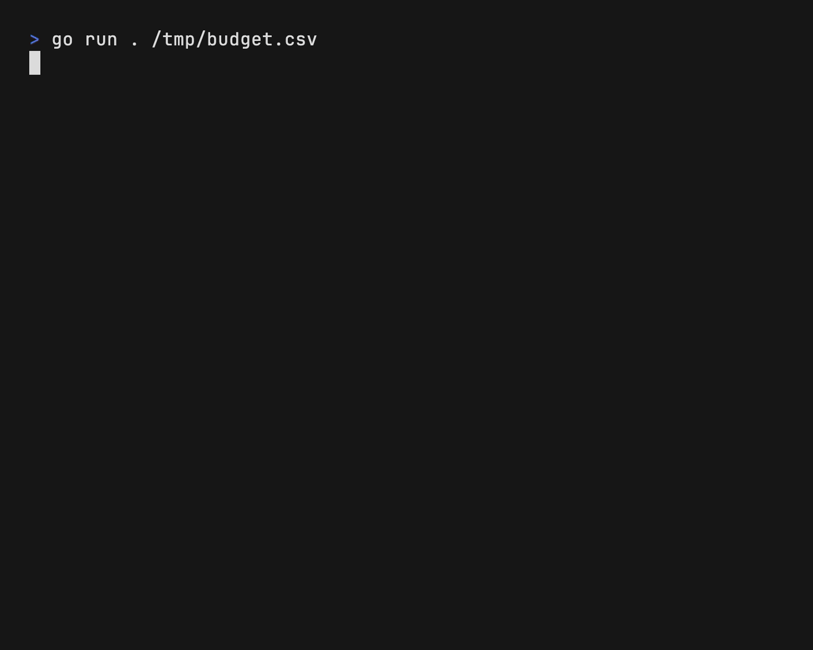

# Sheets

Spreadsheets in your terminal.



## Command Line Interface

Launch the TUI

```bash
> sheets budget.csv
```

Read a specific `CELL`

```bash
> sheets budget.csv B9
2760
```

Writea specific `CELL`

```bash
> sheets budget.csv B8=20
```

## Installation

<!--

Use a package manager:

```bash
# macOS
brew install sheets

# Arch
yay -S sheets

# Nix
nix-env -iA nixpkgs.sheets
```

-->

Install with Go:

```sh
go install github.com/maaslalani/sheets@main
```

Or download a binary from the [releases](https://github.com/maaslalani/sheets/releases).

## License

[MIT](https://github.com/maaslalani/sheets/blob/master/LICENSE)

## Feedback

I'd love to hear your feedback on improving `sheets`.

Feel free to reach out via:
* [Email](mailto:maas@lalani.dev)
* [Twitter](https://twitter.com/maaslalani)
* [GitHub issues](https://github.com/maaslalani/invoice/issues/new)

---

<sub><sub>z</sub></sub><sub>z</sub>z
